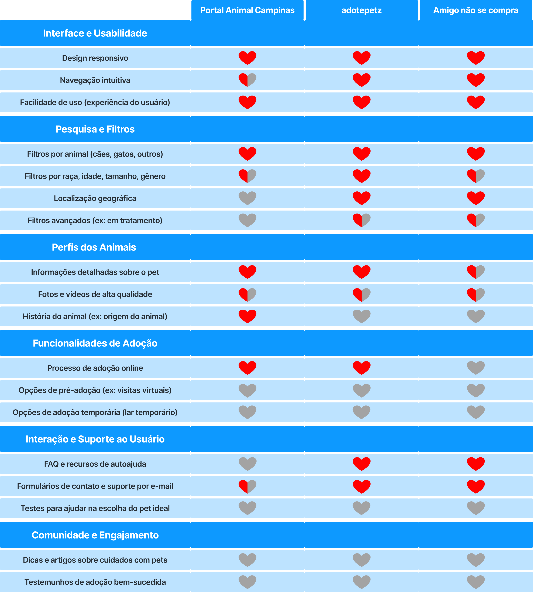

# Link Figma:

> https://www.figma.com/design/tE7CYFCgykPNcOuoJmb3ye/Figma-G.A.F.?node-id=0-1&node-type=CANVAS&t=1cO6F5YcVXyA5QwZ-0

# Benchmark:

# Descrição de Telas:

## 1 - Login

- Terá um campo para logar no site com e-mail e senha
- Caso seja o primeiro acesso, terá um botão para se cadastrar.

## 2 - Cadastro

- A pessoa irá preencher suas informações pessoais para se cadastrar no site.
- São informações como: Nome completo, telefone, e-mail e senha

## 3 - Tela principal

- Nessa tela terá uma navbar, nela teremos a logo, abas de direcionamentos para assuntos do site (sobre nós, perfil do usuário e "seja um lar temporário" )
- Teremos um botão de "doação" para quem quiser apoiar a causa
- Do lado desse botão, teremos um texto (campanha)
- Logo abaixo, teremos 3 cards clicáveis onde levaram para cada tela especifica daquele assunto:
- - Primeiro card - Foto dos animais com os números de animais resgatados/disponíveis para a adoção
- - Segundo card - ONG´s que são nossas parceiras no projeto
- - Terceiro card - Cadastro de animais perdidos e resgatados (Os próprios usuários faram o cadastro desses animais)

## 4 - Aba "Seja um Lar Temporário"

- O Usuário, maior de 18 anos, poderá cadastrar sua residência para se disponibilizar para ser um lar temporário para algum bichinho.
- Os requisitos para ser um lar transitório são: ter espaço, consentimento dos outros moradores, tempo disponível, algum recurso e carinho para acolher temporariamente um ou mais animais até que encontrem um lar definitivo.

## 5 - Seção "Adote"

- Será categorizada por tipo de animal (gato, cachorro, coelho, etc.), porém também terá a opção "Sem filtro"
- Quando o usuário clicar em algum animal, será aberta uma página de sobreposição contendo mais informações sobre o bicho em específico.
- A partir da escolha do pet, o usuário irá preencher uma solicitação com seus dados. Essa solicitação será automaticamente enviada para o perfil dos responsáveis pelo local onde o animal se encontra alocado.
- Assim que a requisição ser visualizada pelo responsável do animal, iremos marcar uma visita, onde o adotante poderá conhecer melhor o seu futuro pet e a empresa conseguirá avaliar o cliente

## 6 - Seção "ONG's"

- Possibilidade de escolher o pet a partir da ONG desejada
- Os responsáveis pela ONG poderão se inscrever no site para poderem divulgar seus animais disponíveis

## 7 - Seção "Perdidos e abandonados"

- Possibilidade dos usuários de realizarem o cadastro dos animais que forem encontrados por eles, podendo escolher entre a categoria "perdido" ou "abandonado", sendo os perdidos aqueles que tem um dono, porém precisam de divulgação, e os abandonados os que estão em situação de rua.
- O usuário deverá incluir no cadastro do animal tipo de animal, foto, local onde foi encontrado, sexo (se for possível distinguir) e porte.

## 8 - Aba de perfil do usuário

- Cliente poderá acessar suas informações e atualizá-las.
- Será possível excluir seu cadastro.
